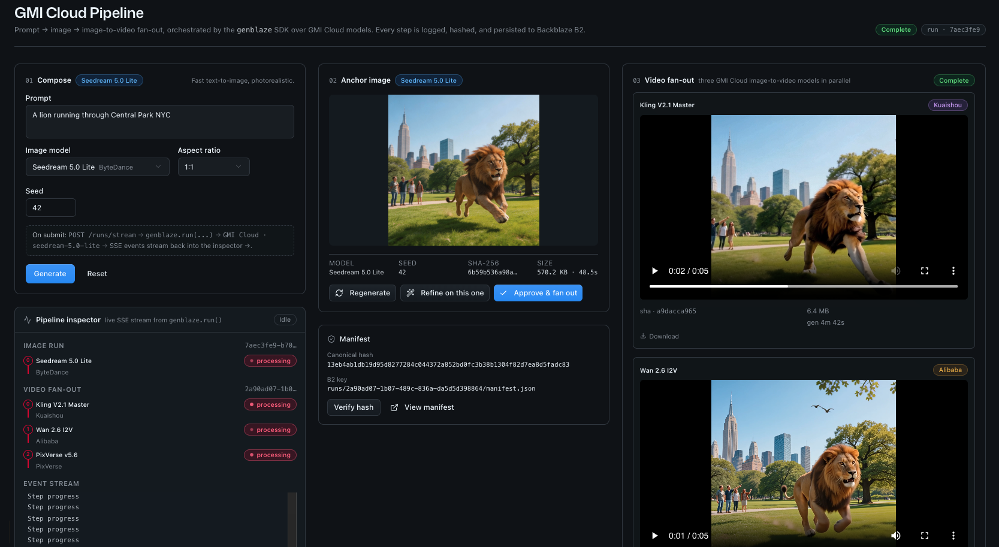

<!-- last_verified: 2026-04-27 -->
# Genblaze × GMICloud Generative Pipeline

A sample app showing how to compose **GMICloud** image and video models with
**[Genblaze](https://github.com/backblaze-labs/genblaze)** and persist every
artifact to **[Backblaze B2](https://www.backblaze.com/sign-up/ai-cloud-storage?utm_source=github&utm_medium=referral&utm_campaign=ai_artifacts&utm_content=gmicloud)**
with a SHA-256–verified manifest. One prompt becomes an anchor image, you
iterate to your liking, then fan out concurrently to three video models — all
under ~100 lines of Genblaze-specific glue.



```
prompt → seedream-5.0-lite → (iterate / refine) → Approve
    ↓                                                ↓
                         ┌─── Kling-Image2Video-V2.1-Master ─┐
                         ├─── wan2.6-i2v ─────────────────────┤  → manifest.json (B2)
                         └─── pixverse-v5.6-i2v ──────────────┘
```

## What's inside

- **End-to-end pipeline.** Image → iterate → fan-out video, streaming each step
  over Server-Sent Events to the browser.
- **Provable provenance.** Every run lands in B2 with a canonical-hash
  `manifest.json`; flip one flag to make manifests Object-Lock immutable.
- **Zero direct `boto3`.** All storage goes through `genblaze-s3`, with the
  S3-compatible API and a project-tagged user agent.
- **Layered architecture.** Genblaze imports are confined to a single ~100-line
  `repo/pipelines.py`; structural tests fail the build if that boundary leaks.

## Quickstart

```bash
git clone https://github.com/backblaze-labs/genblaze-gmicloud-pipeline.git
cd genblaze-gmicloud-pipeline

# 1. Credentials — single .env at the project root
cp .env.example .env       # then fill in credentials (see Configuration)

# 2. Backend — Python venv + deps
cd services/api
python -m venv .venv && source .venv/bin/activate
pip install -r requirements.txt
cd ../..

# 3. Frontend — workspace deps
pnpm install

# 4. Run both (Next.js :3000, FastAPI :8000)
pnpm dev
```

Open <http://localhost:3000> for the Studio. The API self-documents at
<http://localhost:8000/docs>.

> First time? See [Prerequisites](#prerequisites) for what to install and which
> accounts to create.

## Stack

| Layer        | Tech                                                   |
| ------------ | ------------------------------------------------------ |
| Frontend     | Next.js 16 · React 19 · Tailwind · shadcn/ui           |
| Backend      | FastAPI · Pydantic v2 · Genblaze Core                  |
| Image models | GMICloud via `genblaze-gmicloud`                       |
| Video models | GMICloud via `genblaze-gmicloud`                       |
| Storage      | Backblaze B2 via `genblaze-s3` (S3-compatible)         |
| Streaming    | Server-Sent Events (typed `StreamEvent` discriminator) |

## Prerequisites

- **Node.js ≥ 20** and **pnpm ≥ 9** — [installation guide](https://pnpm.io/installation)
- **Python ≥ 3.11**
- A **[Backblaze B2 account](https://www.backblaze.com/sign-up/ai-cloud-storage?utm_source=github&utm_medium=referral&utm_campaign=ai_artifacts&utm_content=-gmicloud)** (free tier is enough)
  - A bucket — create one in your [B2 dashboard](https://secure.backblaze.com/b2_buckets.htm?utm_source=github&utm_medium=referral&utm_campaign=ai_artifacts&utm_content=gmicloud)
  - An application key with `readFiles`, `writeFiles`, `deleteFiles` scoped to that bucket
- A **[GMICloud](https://gmicloud.ai/)** account and API key — image/video model access

## Configuration

A single `.env` at the project root drives both the FastAPI backend and any
frontend env. Edit `.env`:

```env
# Backblaze B2 — S3-compatible endpoint for the region your bucket lives in
B2_ENDPOINT=https://s3.<region>.backblazeb2.com
B2_REGION=<region>                     # e.g. us-west-004, eu-central-003
B2_KEY_ID=
B2_APPLICATION_KEY=
B2_BUCKET_NAME=

# GMICloud — https://gmicloud.ai/
GMI_API_KEY=
```

Region is derived from the bucket — never hardcode it elsewhere. Variable names
match the Backblaze B2 sample-apps standard (no `AWS_*` prefixes, no `B2_S3_*`
aliases).

A handful of optional knobs (local step cache, OpenTelemetry, completion
webhook, CORS overrides) are documented inline in
[`.env.example`](.env.example). Pydantic Settings reads the root `.env` via
an absolute path, so the API service finds it regardless of which directory
`uvicorn` or `pytest` was launched from.

## Usage walkthrough

1. Enter a prompt, pick an aspect ratio, seed, and image model. Click **Generate**.
2. **Iterate** with *Regenerate* (new seed) or *Refine on this one* (text + the
   current image as a visual reference via `flux-kontext-pro`).
3. **Approve** to fan out to three video models concurrently.
4. **Verify** the manifest: every run writes a SHA-256-canonicalized
   `manifest.json` to B2.
5. **Browse** what landed in B2 from the *Files* tab.

Detailed flows: [docs/app-workflows.md](docs/app-workflows.md) ·
Per-feature deep-dives: [docs/features/](docs/features/)

## Model catalog

| Model slug                       | Type            | Notes                              |
| -------------------------------- | --------------- | ---------------------------------- |
| `seedream-5.0-lite`              | Image           | Default anchor model               |
| `flux-kontext-pro`               | Image (refine)  | Image-as-reference iteration flow  |
| `Kling-Image2Video-V2.1-Master`  | Video           | Fan-out slot 1                     |
| `wan2.6-i2v`                     | Video           | Fan-out slot 2                     |
| `pixverse-v5.6-i2v`              | Video           | Fan-out slot 3                     |

Slugs are case-sensitive — exactly as GMICloud expects.

## About Genblaze

[**Genblaze**](https://github.com/backblaze-labs/genblaze) is the open-source
SDK that does the heavy lifting in this sample. It provides:

- **`genblaze-core`** — a fluent `Pipeline(...).step(...).stream()` API for
  generative workflows, with typed `StreamEvent`s, a step cache, tracers
  (logging + OpenTelemetry), and pluggable sinks.
- **`genblaze-gmicloud`** — a provider package that maps Pipeline steps onto
  GMICloud image and video model endpoints.
- **`genblaze-s3`** — an S3-compatible storage backend with first-class support
  for Backblaze B2 (`S3StorageBackend.for_backblaze(...)`), durable URLs,
  multipart uploads, and Object Lock.
- **Manifests** — every run produces a SHA-256-canonicalized `Manifest` that
  records inputs, outputs, asset URLs, and lineage (`parent_run_id`),
  uploaded to your bucket as the durable record of the run.

This sample keeps Genblaze imports confined to one file — see
[`services/api/app/repo/pipelines.py`](services/api/app/repo/pipelines.py) for
the full integration in under 100 lines. To dive deeper, head to the
[Genblaze repo](https://github.com/backblaze-labs/genblaze).

## About GMICloud

[**GMICloud**](https://gmicloud.ai/) is the inference platform serving the
image and video models behind every step in this pipeline. In this sample:

- **Image models** — `seedream-5.0-lite` (text-to-image anchor) and
  `flux-kontext-pro` (image-as-reference refinement) drive the generate /
  iterate flow.
- **Video models** — `Kling-Image2Video-V2.1-Master`, `wan2.6-i2v`, and
  `pixverse-v5.6-i2v` run concurrently on the approved anchor image during the
  fan-out stage.
- **Authentication** — a single `GMI_API_KEY` covers all model calls; create
  one at <https://gmicloud.ai/>.
- **Integration** — every GMI request is issued by the `genblaze-gmicloud`
  provider; this sample does not call GMICloud HTTP endpoints directly. To add
  a new model, append its slug to `DEFAULT_VIDEO_MODELS` in
  `app/types/runs.py` (or pass `image_model="..."` on the request) — the
  provider forwards the slug to GMICloud as-is.

## Project layout

```
genblaze-gmicloud-pipeline/
├── apps/web/               Next.js 16 + React 19 Studio UI
├── services/api/           FastAPI backend
│   └── app/
│       ├── repo/           ← only place genblaze_* imports live
│       ├── runtime/        FastAPI route handlers (SSE bridges)
│       ├── types/          Pydantic models (no DTO mirroring)
│       └── config/         Settings (pydantic-settings)
├── packages/shared/        Cross-target TypeScript types
├── docs/                   Architecture, features, workflows
└── infra/                  Optional infra notes
```

Key invariant: Genblaze imports appear **only** in
`services/api/app/repo/pipelines.py`, and `boto3` / `botocore` is never
imported directly anywhere in the sample source. Both are enforced by
`pnpm check:structure`.

## Architecture in one paragraph

Three pipeline builders (`build_image_pipeline`, `build_iteration_pipeline`,
`build_video_fanout`) return configured `Pipeline` objects. The runtime layer
streams each via `pipeline.stream(sink=ObjectStorageSink(...))`, yielding typed
`StreamEvent` records that FastAPI bridges to SSE. On completion the
`PipelineResult` is cached in-memory so iterate/approve endpoints can fork from
it. Assets and the SHA-256 manifest land in B2 via the sink — no application
code touches `boto3`.

Full topology: [ARCHITECTURE.md](ARCHITECTURE.md)

## Development

```bash
pnpm dev              # Run web + api with hot reload
pnpm test:api         # Backend pytest suite (fast)
pnpm lint             # Next.js ESLint
pnpm lint:api         # ruff check
pnpm check:structure  # Layer + boto3 invariants
pnpm test:e2e         # Playwright (requires dev server running)

# Full pre-PR sweep:
pnpm lint && pnpm lint:api && pnpm test:api && pnpm check:structure
```

More: [docs/dev-workflows.md](docs/dev-workflows.md)

## Object Lock (manifests as tamper-proof records)

To make manifests immutable, enable Object Lock on your bucket and add one line
to `_sink()` in `services/api/app/repo/pipelines.py`:

```python
ObjectStorageSink(
    backend, prefix="runs",
    manifest_lock=ObjectLockConfig(mode="COMPLIANCE", days=365),
)
```

Once written, manifests under `runs/` cannot be deleted or overwritten — even
by the account root — until retention expires. See
[docs/features/manifest.md](docs/features/manifest.md).

## Troubleshooting

- **`/health` reports `b2_connected: false`** — re-check `B2_ENDPOINT`,
  `B2_REGION`, and that the application key is scoped to `B2_BUCKET_NAME` with
  `readFiles` + `writeFiles` permissions.
- **GMICloud 401 / 403** — `GMI_API_KEY` missing or expired; regenerate it in
  your [GMICloud](https://gmicloud.ai/) console.
- **Same prompt always returns the same image** — that's the local step cache
  (set via `STEP_CACHE_DIR` in the root `.env`). Delete the directory to force a
  fresh GMI call.
- **CORS errors from the web app** — set `API_CORS_ORIGINS` in the root
  `.env` if your dev server runs on a different origin (see `.env.example`).
- **`pnpm check:structure` fails after edits** — you've imported `genblaze_*`
  outside `repo/pipelines.py` or `boto3` somewhere in the sample source. See
  [AGENTS.md](AGENTS.md) for the layer rules.

## Documentation

| Doc | Purpose |
| --- | --- |
| [AGENTS.md](AGENTS.md) | Layer discipline, env standard, model slugs (authoritative) |
| [ARCHITECTURE.md](ARCHITECTURE.md) | Pipeline topology + storage flows |
| [docs/app-workflows.md](docs/app-workflows.md) | End-user journeys |
| [docs/dev-workflows.md](docs/dev-workflows.md) | Engineering workflows |
| [docs/features/](docs/features/) | Per-feature deep-dives (image, iteration, video fan-out, manifest, files) |
| [docs/SECURITY.md](docs/SECURITY.md) | Security posture |
| [docs/RELIABILITY.md](docs/RELIABILITY.md) | Reliability + retry semantics |

## License

[MIT](LICENSE)
